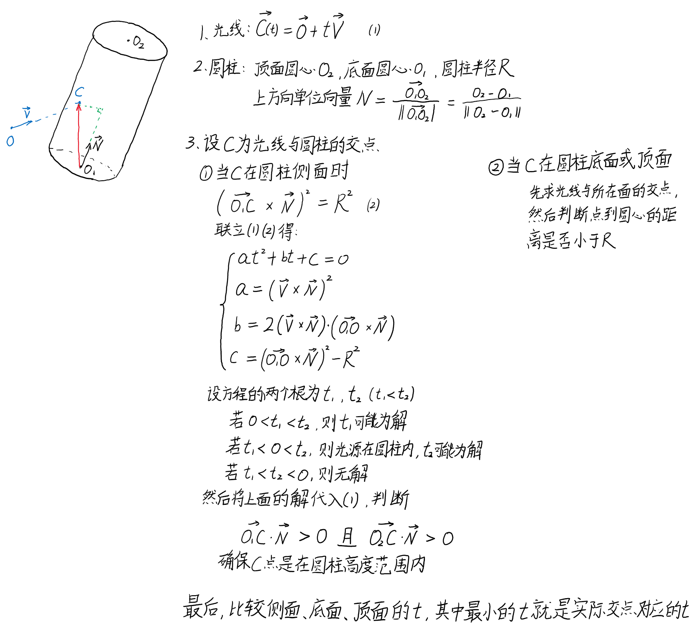
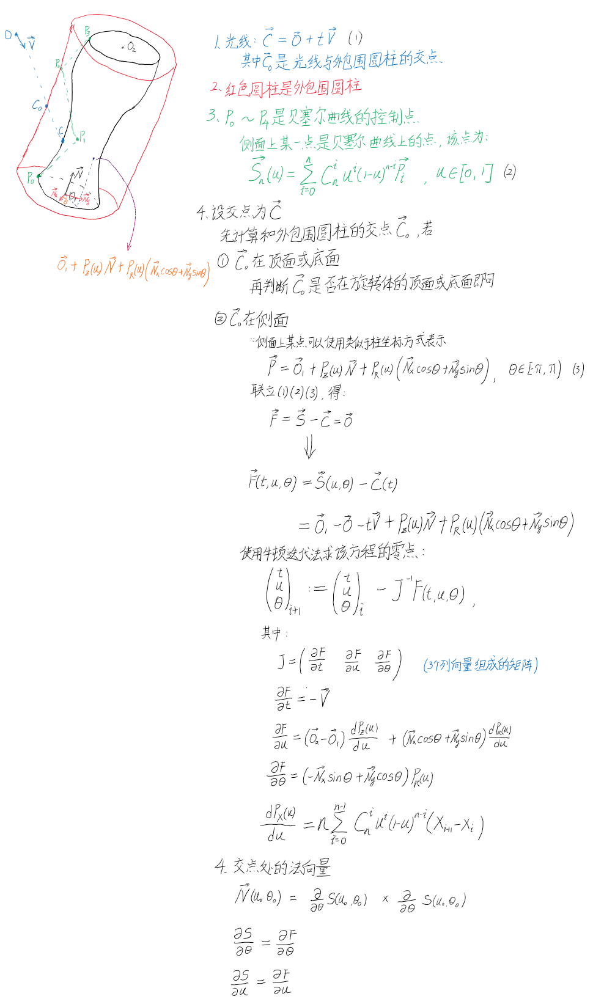

# A5-实现以下材料中的光线跟踪算法

## 一、实验结果

矩形光源 + 墙壁与地板expBlur分布式反射 + 圆柱 + 贝塞尔曲线旋转体


光源采样次数：1024，分布式反射采样次数：16


## 二、实验环境

Windows 10

依赖库：Eigen 3.3.8


## 三、实验步骤

1. 执行``Output``文件夹中的A5_raytracer.exe，输入场景信息txt和结果图片的路径

2. 默认``final.txt``为场景信息txt，``picture.bmp``是输出的结果

3. **确保txt和txt中的纹理图片都在程序能访问到的文件夹中**


## 四、实验原理

### 4.1 光线与圆柱体相交




### 4.2 光线与贝塞尔曲线旋转体相交



牛顿迭代法的初值设为光线与外包围圆柱的交点。

**注意：**

1. 牛顿迭代法的结果会有误差，这可能会导致从交点发出的反射光线、折射光线和阴影测试时的线被困在物体内部。因此，需要将交点沿法向量方向进行微小偏移。

   程序的实现方式如下：

   - 反射和阴影测试：
     $$
     \vec C := \vec C + \alpha \vec N, \alpha = 0.01
     $$

   - 折射：
     $$
     \vec C := \vec C - \alpha \vec N, \alpha = 0.01
     $$
     


### 4.3 矩形光源

在每次判断当前交点是否在阴影中时，程序先在矩形区域随机选取若干个点，判断从该点到交点之间是否有物体。若有物体，则说明当前选取的光源点无法照射到交点；反之能照射到。

最后程序计算能照射到交点的光源点个数，以此作为交点能接收到光照的比率。通过这种方式能够实现软阴影。

```c++
int shadeCount = 0;
int sampleCount = shade_quality;
for (int i = 0; i < sampleCount; i++) {
    double x = length * (2.0 * ran() - 1.0), y = width * (2.0 * ran() - 1.0);
    Vector3 lightPoint = O + x * xDir + y * yDir;
    Vector3 V = lightPoint - C;
    double dist = V.Module();
    for (Primitive *now = primitive_head; now != NULL; now = now->GetNext()) {
        CollidePrimitive tmp = now->Collide(C, V);
        if (tmp.isCollide && EPS < (dist - tmp.dist)) {
            shadeCount++;
            break;
        }
    }
}
double shade = 1.0 - (double) shadeCount / (double) sampleCount;
return shade;
```

**注意：**

1. 如果随机选取的次数太少，则阴影边缘处会出现类似于噪声一样的情况。


### 4.4 球形光源

与矩形光源类似，程序先在与交点到球心方向垂直的圆面上随机选取若干个点，判断从该点到交点之间是否有物体。其他与实现矩形光源的方式相同。


**注意：**

1. 对圆面进行随机取样时，参数*r*必须要开根，否则采样点的分布会集中于圆心。

   参考：https://stackoverflow.com/questions/5837572/generate-a-random-point-within-a-circle-uniformly

2. 程序将球形光源也当作物体，所以采样点必须要移动至球的表面，否则程序会认为该采样点与交点之间有球形光源这一个物体遮挡。

   ```c++
   double radius = R * sqrt(ran()), theta = 2 * PI * ran();
   double x = radius * cos(theta), y = radius * sin(theta);
   
   double phi = acos(x / R);
   double z = R * sin(phi);
   
   Vector3 lightPoint = O + x * xDir + y * yDir + z * zDir;
   Vector3 V = lightPoint - C;
   ```

   


### 4.4 分布式反射

对于分布式反射，程序通过对反射光线的方向进行一定的随机偏移来实现。

具体实现方式是，在交点的切平面上随机生成*x*和*y*坐标，以此获得反射光线在切平面上的偏移。

```c++
Vector3 N = collide_primitive.N;
Vector3 xDir = N.GetAnVerticalVector();
Vector3 yDir = (xDir * N).GetUnitVector();
double z = ray_V.Dot(N);

Color ret;
for (int k = 0; k < camera->GetDreflQuality(); k++) {
    double x, y;
    x = primitive->GetMaterial()->blur->GetXY().first * primitive->GetMaterial()->drefl;
    y = primitive->GetMaterial()->blur->GetXY().second * primitive->GetMaterial()->drefl;
    ray_V = x * xDir + y * yDir + z * N;
    ret += RayTracing(collide_primitive.C, ray_V, dep + MAX_DREFL_DEP, NULL);
}
ret /= DISTRIBUTED_REFLECTION_COUNT * camera->GetDreflQuality();
```


## 五、在64位Linux下编译的一些问题

在``bmp.h``中，结构体``BITMAPINFOHEADER``中有两个变量``biWidth``和``biHeight``的类型是long。

```c++
struct BITMAPINFOHEADER {
	dword biSize;
	long biWidth;
	long biHeight;
	word biPlanes;
	word biBitCount;
	dword biCompression;
	dword biSizeImage;
	long biXPelsPerMeter;
	long biYPelsPerMeter;
	dword biClrUsed;
	dword biClrImportant;
};
```

然而，64位Windows下long的长度是4个字节，而64位Linux下long的长度是8个字节，这导致程序在Linux下编译后无法获得正确的图像尺寸，最终导致在读取纹理颜色时出现越界的问题。

参考：https://www.ibm.com/support/knowledgecenter/en/SSFKSJ_9.0.0/com.ibm.mq.ref.dev.doc/q104610_.htm


解决方式：

改用dword

```c++
struct BITMAPINFOHEADER {
	dword biSize;
    dword biWidth;
    dword biHeight;
	word biPlanes;
	word biBitCount;
	dword biCompression;
	dword biSizeImage;
    dword biXPelsPerMeter;
    dword biYPelsPerMeter;
	dword biClrUsed;
	dword biClrImportant;
};
```

