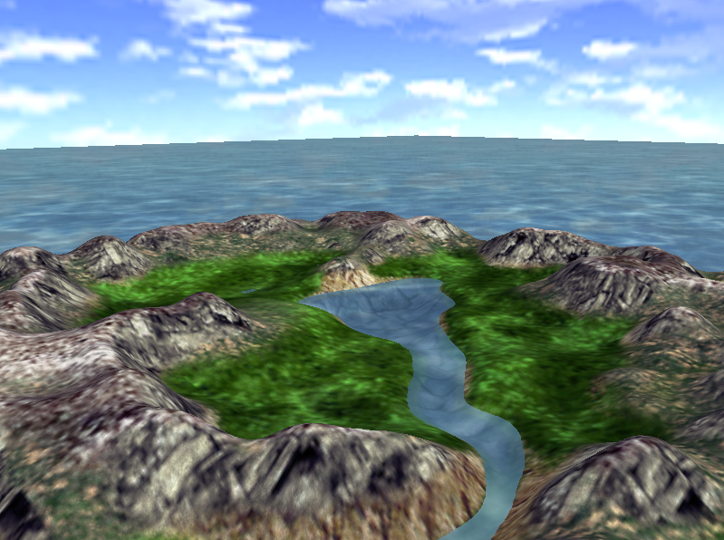
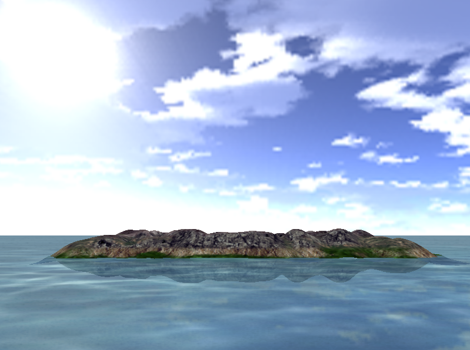

# A6-实现以下材料中的Terrain Engine

## 一、实验结果

### 1.1 地形



### 1.2 倒影




## 二、实验环境

Windows 10， OpenGL 3.3

依赖库：GLFW 3.3.2，Glad， GLM 0.9.9.7


## 三、实验步骤

### 3.1 启动程序

直接执行``Output``文件夹中的A6_terrainengine.exe
**（确保glsl文件在``Code/shader``文件夹中，纹理图片在``Code/texture``文件夹中，exe文件在``Output``文件夹中）**

### 3.2 交互方式

WASD键控制摄像机的移动，鼠标控制视角的移动。


## 四、实验原理

### 3.1 天空盒

使用一个巨型的立方体，并在其除了底面外的五个面绘制天空纹理。

天空纹理在加载时需要使用``GL_CLAMP_TO_EDGE``，否则边缘处会比较明显。


### 3.2 水面流动效果

首先根据根据运行时间获得纹理坐标的偏移。然后将偏移传入天空盒的片段着色器中，从而实现水面流动的效果。

```c++
float dist = (float) glfwGetTime() * 0.1;
glm::vec2 texTranslate = glm::vec2(dist, dist);
// ...
shader.setVec2("texTranslate", texTranslate);
```

```glsl
#version 330 core
out vec4 FragColor;

in vec2 TexCoords;

uniform sampler2D skybox;
uniform vec2 texTranslate;

void main()
{
    FragColor = texture(skybox, texTranslate + TexCoords);
}
```


### 3.3 地形高度

首先将一个正方形区域均匀设置256 x 256个点，同时根据这样的划分获得每个点对应的纹理坐标。

然后，每个点的x和y坐标就是正方形边长的1/256，z坐标为高度图中对应纹理坐标的灰度值，并将z坐标缩放到[0,1]之间。

同时，为了能让岛屿能够没入水中，z坐标需要减去一个小的偏差。

```c++
float lengthInterval = LENGTH / (float) (LENGTH_VERTEX_NUM - 1);
float widthInterval = WIDTH / (float) (WIDTH_VERTEX_NUM - 1);
for (int i = 0; i < LENGTH_VERTEX_NUM; i++) {
    for (int j = 0; j < WIDTH_VERTEX_NUM; j++) {
        float x = lengthInterval * i, z = widthInterval * j;
        float u = x / (LENGTH), v = z / (WIDTH);
        int heightmap_u = u * (heightmapHeight - 1), heightmap_v = v * (heightmapWidth - 1);
        float y = heightmapData[heightmap_v * heightmapWidth + heightmap_u] / 256.0 * 1.0 - DOWN_OFFSET;

        Vertex vertex{glm::vec3(x, y, z), glm::vec2(u, v)};
        vertices.push_back(vertex);
    }
}
```


### 3.4 地形纹理

首先对于细节纹理，程序将纹理坐标放大20倍。用放大后的纹理坐标去获得细节纹理。然后将粗糙纹理和细节纹理相乘，获得颜色。

由于直接相乘会使得亮度太低，因此将结果中的RGB值再乘以2，提高结果的亮度。

```glsl
vec4 terrainColor = texture(terrainTexture, TexCoords);
vec4 detailColor = texture(detailTexture, TexCoords * vec2(20.0f, 20.0f));
FragColor = terrainColor * detailColor * vec4(2.0, 2.0, 2.0, 1.0);
```


### 3.5 倒影

首先设置模型矩阵将岛屿进行反转，然后程序再次绘制反转后的岛屿。同时向地形的定点着色器中传入剪切平面，将反转后在水面上的部分切除。

```c++
glm::vec4 clipPlane = glm::vec4(0.0, 1.0, 0.0, 0.0);
//...
shader.setVec4("clipPlane", clipPlane);
```

```glsl
uniform vec4 clipPlane;

void main()
{
    //...
    gl_ClipDistance[0] = dot(model * Position, clipPlane);
}
```

然后将水面当作半透明图形进行混合处理。

由于反转后的岛屿在水面之下，水面会在深度测试时遮挡住反转后的岛屿，因此在绘制水面时需要关闭深度测试。

```c++
glDepthMask(GL_FALSE);
glBlendColor(0.0, 0.0, 0.0, 0.8);
glBlendFunc(GL_CONSTANT_ALPHA, GL_ONE_MINUS_CONSTANT_ALPHA);
glEnable(GL_BLEND);

skybox.DrawWave(skyboxShader, camera);

glDisable(GL_BLEND);
glDepthMask(GL_TRUE);
```


### 3.6 交互

利用OpenGL函数对键盘按键的监听，在每一次渲染时处理按下的按键，从而实现摄像机前后左右移动；利用鼠标的回调机制，实现视角的上下左右移动。