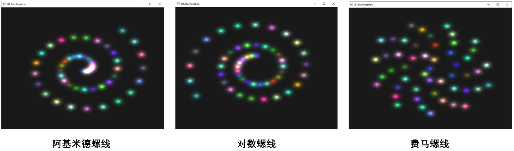
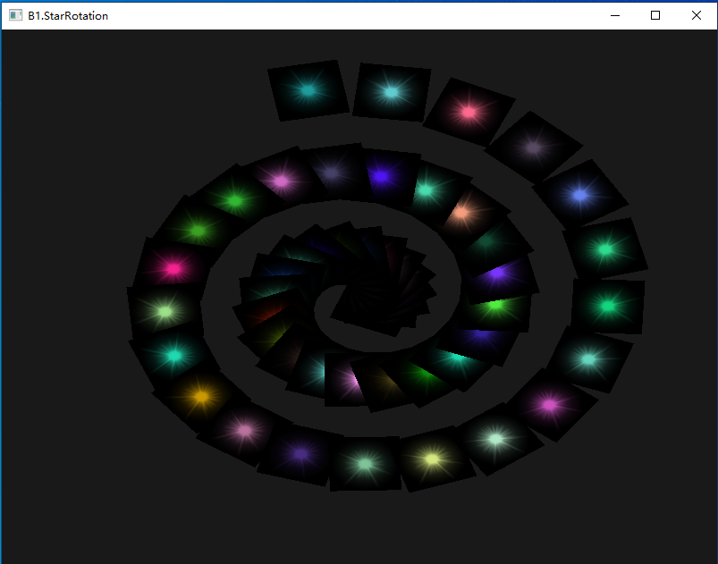

# B1-绘制出星星旋转的效果

### 一、实验效果




### 二、实验环境

Windows 10， OpenGL 3.3

依赖库：GLFW 3.3.2，Glad， GLM 0.9.9.7


### 三、实验步骤

#### 3.1 启动程序

直接执行``Output``文件夹中的B1_starrotation.exe**（确保glsl文件在``Code``文件夹中且exe文件在``Output``文件夹中）**

#### 3.2 交互方式

F1、F2、F3按键控制选择的螺线：

1. F1为阿基米德螺线
2. F2为对数螺线
3. F3为费马螺线


### 四、实验原理

#### 4.1 星星

使用一个正方形来表示星星，然后让这个正方形将星星图片当作纹理进行渲染。

同时随机生成RGB值作为星星的颜色。

#### 4.2 放置星星

在初始化星星的时候设定其位置在极坐标下的弧度。

```c++
Star star[STAR_NUM];
float spin = 0.0;
bool isFermatRadiusNeg = false;
for (int i = 0; i < STAR_NUM; i++) {
    float r = (rand() % 256) / 256.0;
    float g = (rand() % 256) / 256.0;
    float b = (rand() % 256) / 256.0;
    star[i].spin = spin;
    star[i].Color = glm::vec3(r, g, b);
    star[i].isFermatRadiusNeg = isFermatRadiusNeg;

    spin += 0.30;
    isFermatRadiusNeg = !isFermatRadiusNeg;
}
```

然后根据弧度和螺线类型计算出星星位置的半径。

```c++
if (type == ARCHIMEDEAN) {
	float a = 0.05, b = 0.05;
	radius = a + b * spin;
} else if (type == LOGARITHMIC) {
	float a = 0.2, b = 0.1;
	radius = a * exp(b * spin);
} else if (type == FERMAT) {
	radius = 0.2 * sqrt(spin);
	radius = isFermatRadiusNeg? -radius: radius;
}
```

然后将极坐标转成直角坐标。

```c++
float starX = radius * cos(spin);
float starY = radius * sin(spin);
return glm::vec3(starX, starY, 0.0);
```

这样就能获得星星在显示平面上的位置。

#### 4.3 旋转

首先根据根据运行时间计算旋转角度。然后先将星星大小进行放缩、旋转自身、平移到指定位置、根据旋转角度进行旋转，获得对应的模型矩阵。

```c++
float angle = glm::radians((float) glfwGetTime() * 50.0);
// ...
glm::mat4 transform(1.0);
transform = glm::rotate(transform, angle, glm::vec3(0.0, 0.0, 1.0));
transform = glm::translate(transform, star[i].GetPosition());
transform = glm::rotate(transform, star[i].spin, glm::vec3(0.0, 0.0, 1.0));
transform = glm::scale(transform, glm::vec3(0.1, 0.1, 0.1));
```

然后将该矩阵传入三角形的顶点着色器。顶点着色器先将坐标点乘以模型矩阵后再输出为实际坐标。

#### 4.4 混合

由于使用一个正方形来当作星星，并且除了星星部份外纹理颜色时黑色，这就会使得：

1. 在星星非常靠近的时候会出现遮挡
2. 当背景颜色不是黑色时，能明显看出正方形轮廓



所以需要把纹理图形当作半透明图像进行渲染，以此避免这种情况。

```c++
glBlendFunc(GL_SRC_ALPHA, GL_ONE); // 设置混色函数取得半透明效果
glEnable(GL_BLEND);
```