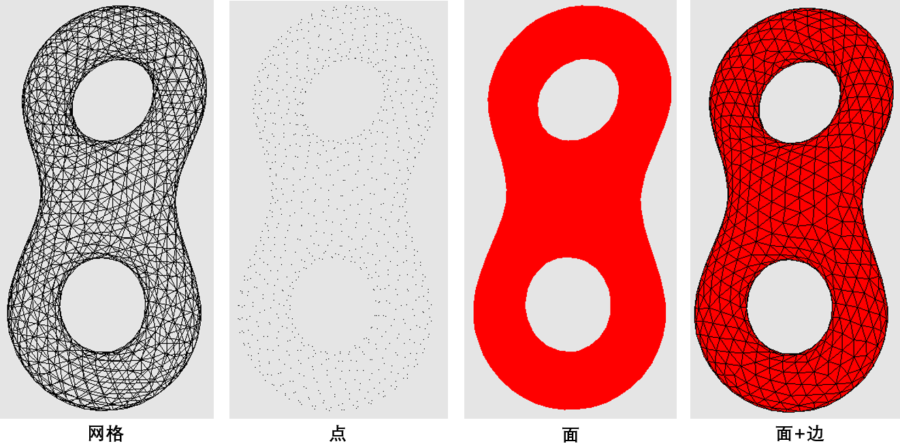

# B3-三维模型的显示

### 一、实验效果




### 二、实验环境

Windows 10， OpenGL 3.3

依赖库：GLFW 3.3.2，Glad， GLM 0.9.9.7


### 三、实验步骤

#### 3.1 启动程序

直接执行``Output``文件夹中的B3_3dmodel.exe

**（确保glsl文件在``Code/shader``文件夹中，obj文件在``Code/object``文件夹中，exe文件在``Output``文件夹中）**

#### 3.2 交互方式

F1、F2、F3、F4键选择显示方式：

1. F1为网格模式；
2. F2为点模式；
3. F3为面模式；
4. F4为面和网格模式。


### 四、实验原理

#### 4.1 读取obj文件

直接从obj文件中读取点和面的数据。

```c++
std::string line, keyword;
while (std::getline(file, line)) {
    std::istringstream iss(line);
    iss >> keyword;
    if (keyword == "v") {
        //顶点
        Vertex *v = new Vertex();
        iss >> v->position.x >> v->position.y >> v->position.z;
        vs.push_back(v);
    } else if (keyword == "f") {
        // 面
        Face *f = new Face();
        int index;
        while (iss >> index) {
            f->indexList.push_back(index - 1);
        }
        fs.push_back(f);
    }
}
```


#### 4.2 存储半边结构

半边结构如下：

```c++
class HalfEdge {
    HalfEdge *pair, *next; // 当前半边所对应的另一个半边 围绕面f的下一条半边
    Vertex *v; // 边的终点
    Face *f;   // 当前半边方向的面
};

class Vertex {
    HalfEdge *e; // 以当前点为终点的半边
    glm::vec3 position;
    glm::vec3 normal;
};

class Face {
    HalfEdge *e; // 当前面的某一条半边
    std::vector<int> indexList; // 顶点下标的列表
};
```

由于创建半边结构以及将顶点数据写入OpenGL缓存时都需要某个面所有顶点的小标，因此``Face``类用``indexList``存储其所有顶点的下标。

程序通过一系列面、顶点和半边存储读入的模型：

```c++
class Model {
    std::vector<Face*> modelFaces;
    std::vector<Vertex*> modelVertices;
    std::vector<HalfEdge*> modelHalfEdges;
    /// ...
}
```


#### 4.3 切换显示方式

利用OpenGL函数对键盘按键的监听，在每一次渲染时处理按下的按键，从而让程序知道改为何种显示方式。

```c++
if (glfwGetKey(window, GLFW_KEY_F1) == GLFW_PRESS) {
    showVertices = false;
    showMeshes = true;
    showFaces = false;
}
if (glfwGetKey(window, GLFW_KEY_F2) == GLFW_PRESS) {
    showVertices = true;
    showMeshes = false;
    showFaces = false;
}
if (glfwGetKey(window, GLFW_KEY_F3) == GLFW_PRESS) {
    showVertices = false;
    showMeshes = false;
    showFaces = true;
}
if (glfwGetKey(window, GLFW_KEY_F4) == GLFW_PRESS) {
    showVertices = false;
    showMeshes = true;
    showFaces = true;
}
```

使用``glPolygonMode``函数切换模型的渲染方式。对于同时显示网格和面这一方式，程序会对模型进行多次渲染。

又因为网格线和面上的点的空间位置相同，进行多次渲染时会出现深度冲突。为了避免出现深度冲突，程序使用``glPolygonOffset``函数稍微改变模型点的深度。

```c++
glEnable(GL_POLYGON_OFFSET_LINE);
glPolygonOffset(-1,-1);
// ...
glDisable(GL_POLYGON_OFFSET_POINT);
```