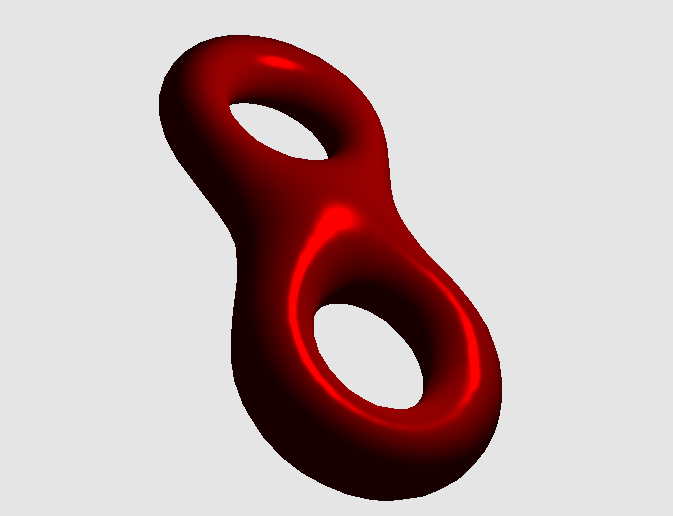

# B4-三维模型的交互与光照效果

### 一、实验效果

#### 1.1 光照效果



#### 1.2 交互

效果详见视频。


### 二、实验环境

Windows 10， OpenGL 3.3

依赖库：GLFW 3.3.2，Glad， GLM 0.9.9.7


### 三、实验步骤

#### 3.1 启动程序

直接执行``Output``文件夹中的B4_3dmodel_interactive.exe
**（确保glsl文件在``Code/shader``文件夹中，obj文件在``Code/object``文件夹中，exe文件在``Output``文件夹中）**

#### 3.2 交互方式

**场景漫游：**WASD键进行前后左右移动。

**模型操作：**鼠标上下左右移动以旋转模型，鼠标滚轮移动以缩放模型。


### 四、实验原理

#### 4.1 交互和模型旋转缩放

利用OpenGL函数对键盘按键的监听，在每一次渲染时处理按下的按键，从而实现摄像机前后左右移动；利用鼠标的回调机制，当鼠标移动时改变模型矩阵。


#### 4.2 计算法向量

由于给定的obj文件中没有法向量数据，因此程序会根据点和面的数据计算法向量。

对于每个顶点，通过对相邻面法向量按面积加权来计算顶点的法向量。面积使用海伦公式计算。

````c++
glm::vec3 Model::getWeightedNormalOfFaceOnTheSideOfThisHalfEdge(HalfEdge *e) {
    glm::vec3 v0 = e->v->position;       // 边的终点
    glm::vec3 v1 = e->pair->v->position; // 边的起点
    glm::vec3 v2 = e->next->v->position; // 从终点出发的边，这一条新半边的终点

    double a = glm::length(v2 - v0);
    double b = glm::length(v1 - v0);
    double c = glm::length(v2 - v1);
    double s = (a + b + c) / 2.0;
    double area = sqrt(s * (s - a) * (s - b) * (s - c));

    return glm::vec3(area) * glm::cross(v2 - v0, v1 - v0);
}
````

由于模型使用半边结构存储，程序可以通过``e->next->pair``遍历相邻面。

```c++
glm::vec3 normal = glm::vec3(0.0, 0.0, 0.0);
HalfEdge *e0 = modelVertices[i]->e;

HalfEdge *e = e0;
if (e->pair == nullptr)
    continue;
normal += getWeightedNormalOfFaceOnTheSideOfThisHalfEdge(e);
if (e->next->pair == nullptr)
    continue;
e = e->next->pair;

while (e != e0) {
    normal += getWeightedNormalOfFaceOnTheSideOfThisHalfEdge(e);
    if (e->next->pair == nullptr)
        break;
    e = e->next->pair;
}

modelVertices[i]->normal = glm::normalize(normal);
```


#### 4.3 光照

实验使用Phong光照模型。程序会将物体材质和点光源属性传入片段着色器。

```c++
shader.setVec3("viewPos", viewPos);
shader.setVec3("light.position", lightPos);
shader.setVec3("light.intensity", 1.0, 1.0, 1.0);
shader.setVec3("material.ambient", 0.1, 0.1, 0.1);
shader.setVec3("material.diffuse", 0.5, 0.5, 0.5);
shader.setVec3("material.specular", 1.0, 1.0, 1.0);
shader.setFloat("material.shininess", 32.0);
shader.setVec3("material.color", color);
```

片段着色器会根据材质和光源属性计算环境光分量、漫反射分量和镜面反射分量，从而获得最终效果。

```glsl
#version 330 core
struct Material {
    vec3 ambient;
    vec3 diffuse;
    vec3 specular;
    float shininess;
    vec3 color;
};

struct Light {
    vec3 position;
    vec3 intensity;
};

uniform vec3 viewPos;
uniform Material material;
uniform Light light;

in vec3 FragPos;
in vec3 Normal;

out vec4 FragColor;

void main() {
    vec3 ambient = material.ambient;

    vec3 normal = normalize(Normal);
    vec3 lightDir = normalize(light.position - FragPos);
    float diff = max( dot(lightDir, normal), 0.0 );
    vec3 diffuse = diff * material.diffuse * light.intensity;

    vec3 viewDir = normalize(viewPos - FragPos);
    vec3 reflectDir = reflect(-lightDir, normal);
    float spec = pow( max(dot(reflectDir, viewDir), 0.0), material.shininess );
    vec3 specular = spec * material.specular * light.intensity;

    vec3 result = (ambient + diffuse + specular) * material.color;

    FragColor = vec4(result, 1.0);
}
```