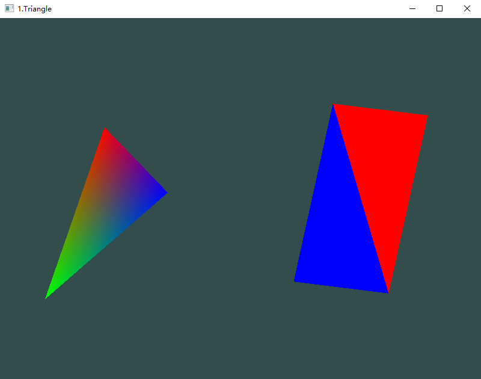

# C1-绘制三角形和四边形并着色，同时旋转和平移

### 一、实验效果




### 二、实验环境

Windows 10， OpenGL 3.3

依赖库：GLFW 3.3.2，Glad， GLM 0.9.9.7


### 三、实验步骤

#### 3.1 启动程序

直接执行``Output``文件夹中的C1_triangle.exe**（确保glsl文件在``Code``文件夹中且exe文件在``Output``文件夹中）**


### 四、实验原理

#### 4.1 三角形

设置三角形三个顶点的坐标和颜色（每一行前三个数值是坐标，后三个数值是RGB值）

```c++
	float triangle[] = {
		0.0, 0.4, 0.0,   1.0, 0.0, 0.0,
		-0.4, -0.5, 0.0, 0.0, 1.0, 0.0,
		0.2, 0.0, 0.0,   0.0, 0.0, 1.0
	};
```

#### 4.2 四边形

设置四边形四个顶点的坐标和颜色（每一行前三个数值是坐标，后三个数值是RGB值）；

同时设置顶点下标，确定四边形由哪几个顶点所构成的三角形进行绘制

```c++
float quadrangle[] = {
    -0.2f, -0.5f, 0.0f, 1.0, 0.0, 0.0,
    0.2f, -0.5f, 0.0f,  0.0, 0.5, 0.0,
    -0.2f, 0.5f, 0.0f,  0.0, 0.0, 1.0,
    0.2f, 0.5f, 0.0f,   1.0, 0.0, 0.0,
};
unsigned int quadIndices[] ={
    0, 1, 2,
    1, 2, 3
};
```

#### 4.3 旋转和平移

首先根据根据运行时间计算旋转角度

```c++
float angle = (float)glfwGetTime() * 50.0;
```

对于三角形，程序计算让三角形先顺时针旋转再向左平移的模型矩阵

```c++
glm::mat4 triTrans(1.0);
triTrans = glm::translate(triTrans, glm::vec3(0.5, 0.0, 0.0));
triTrans = glm::rotate(triTrans, glm::radians(-angle), glm::vec3(0.0, 0.0, 1.0));
```

然后将该矩阵传入三角形的顶点着色器

```c++
triangleShader.setMat4("transform", triTrans);
```

在三角形的顶点着色器中，程序先将坐标点乘以模型矩阵后再输出为实际坐标，并使用smooth着色模式

```glsl
layout (location = 0) in vec3 aPoS;
layout (location = 1) in vec3 aColor;

uniform mat4 transform;

out vec3 Color; // smooth shading

void main()
{
	gl_Position = transform * vec4(aPoS, 1.0);
	Color = aColor;
}
```

对于四边形，程序执行类似于三角形的操作

```c++
glm::mat4 quadTrans(1.0);
quadTrans = glm::translate(quadTrans, glm::vec3(-0.5, 0.0, 0.0));
quadTrans = glm::rotate(quadTrans, glm::radians(-angle), glm::vec3(0.0, 0.0, 1.0));
quadrangleShader.setMat4("transform", quadTrans);
```

在四边形的顶点着色器中，程序使用**``flat``**关键字让着色器不进行插值，从而实现flat着色模式

```glsl
layout (location = 0) in vec3 aPoS;
layout (location = 1) in vec3 aColor;

uniform mat4 transform;

flat out vec3 Color; // flat shading

void main()
{
    gl_Position = transform * vec4(aPoS, 1.0);
    Color = aColor;
}
```
