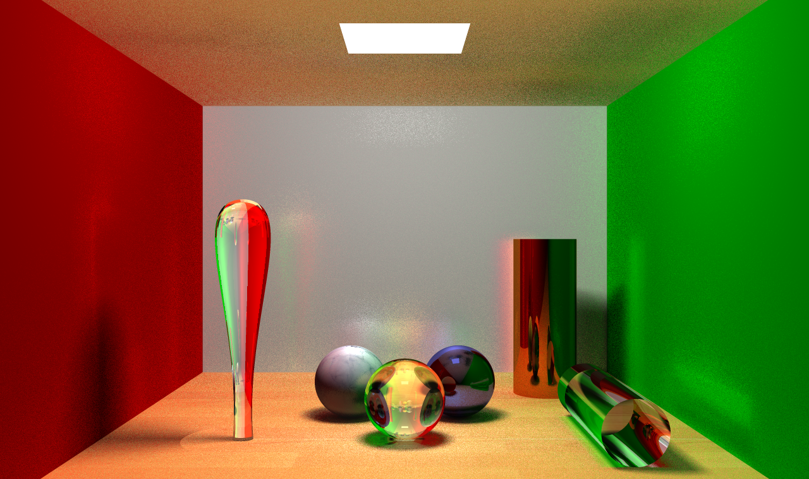

# THU CS Computer Graphics 2020

### [A5 光线追踪器](A5_raytracer)

### [A6 地形引擎](A6_terrainengine)
https://user-images.githubusercontent.com/41474025/211209320-43a9575d-6bb9-4878-ac24-c6cde6e86da5.mp4

### [B1 星星旋转](B1_starrotation)
https://user-images.githubusercontent.com/41474025/211209325-0c1289c0-3d99-44ad-8fd3-07c9467e79e9.mp4

### [B3 显示三维模型](B3_3dmodel)
https://user-images.githubusercontent.com/41474025/211209331-f95275b6-7d66-43bd-a049-33fd2f5b87dd.mp4

### [B4 三维模型的交互与光照效果](B4_3dmoel_interactive)
https://user-images.githubusercontent.com/41474025/211209337-711b3397-cc4a-4532-952e-c4e77285182a.mp4

### [C1 绘制三角形和四边形并运动](C1_triangle)
https://user-images.githubusercontent.com/41474025/211209341-31421e49-a983-432f-ac10-4d6784f93ec8.mp4

### [B4 绘制彩色四棱锥并添加光照](C2_pyramid)
https://user-images.githubusercontent.com/41474025/211209347-965ac2c0-0579-4259-998c-f4842e798f8e.mp4

### [B4 带纹理的正方体](C3_cubic)
